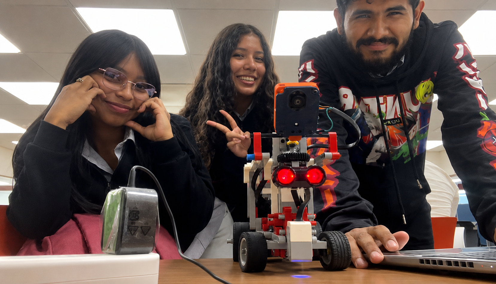

# Team's photos

Welcome to the photo section, where we introduce the members of our group, Avocado.

Alan Saldaña (Man)

Hillary Cerrud (Short girl with straight hair)

Maria Salazar (Tall girl with curly hair)

Coach (The one without a cap)

## Alan Stiven Saldaña Ortega

Alan Saldaña is the head programmer and is the one in charge of programming and testing the changes in the robot's program.

  

## Hillary Abigail Cerrud Small

Hillary Cerrud function in the team is being the head mechanic, having big attention for the little details of the robot.

  

## Maria Cristina Salazar Guerra

Maria Salazar works as a programmer for the team and is the one in charge of working on the Github files.

  

## Funny Photo

  

 
## About us 

We are currently second-year marine biology students who are passionate about robotics and research. We are a very close-knit team that always tries to understand one another and support each other in any way we can. Our skills, developed in different areas, complement one another. Joining the robotics club was a productive way for us to spend our time in college, as well as a challenge that fosters our creativity, problem-solving, and organizational skills. Although we joined with no prior knowledge of robotics, I’d say we’re defined by our resilience and perseverance in acquiring the knowledge we needed to write the code. We also received great support from our mentors, who helped us clarify any questions that came up along the way. 

